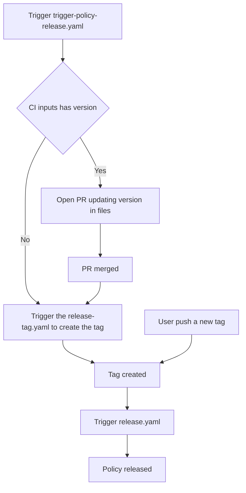

# Contributing to Kubewarden Policies

Thank you for your interest in contributing! This document outlines the
technical workflow for developing, testing, and releasing policies within this
repository.

Kubewarden is language-agnostic. This repository contains policies written in
Rust, Go and Rego.

# Directory Structure

This repository is a monorepo. While each policy is functionally independent,
they share common tooling and dependencies.

```text
.
├── policies/ # Policy source code
│ ├── Cargo.toml # Rust Workspace configuration
│ ├── Cargo.lock # Shared dependency lock file for Rust
│ ├── <policy-name>/ # Specific policy directory
│ │ ├── src/ # Source code
│ │ ├── test_data/ # Files for testing
│ │ ├── Makefile # Standardized build commands
│ │ ├── metadata.yml# Artifact Hub metadata
│ │ ├── <any other policy file>
│ ├── <policy-name>/ # Specific policy directory
│ │ ├── <any other policy file>
```

# Rust Workspace

To optimize build times and ensure consistency, all Rust policies are members
of a single Rust Workspace. The `policies/Cargo.toml` defines the workspace
members. Common dependencies are shared across policies to reduce maintenance
overhead. When adding a new Rust policy, ensure it is added to the members list
in the root Cargo.toml.

# How to Build Policies

We use `make` to provide a consistent interface across different programming
languages.

Navigate to the policy directory:

```console
cd policies/policy-name
```

Build the Wasm binary:

```console
    make policy.wasm
```

# How to Test Policies

All policies in this repository should provide unit test and integration tests.
To run all the tests run the following command:

```console
make test e2e-tests
```

## Language-Scoped Makefile Targets

The root `Makefile` provides targets that operate across all policies
regardless of language (`test`, `lint`, `e2e-tests`). For faster iteration,
language-scoped variants are also available.

| Target           | Scope                                                                             |
| ---------------- | --------------------------------------------------------------------------------- |
| `test-rust`      | Rust policies (detected by `Cargo.toml`) + shared crates under `policies/crates/` |
| `test-go`        | Go policies (detected by `go.mod`)                                                |
| `lint-rust`      | Rust policies + shared crates under `policies/crates/`                            |
| `lint-go`        | Go policies                                                                       |
| `e2e-tests-rust` | Rust policies                                                                     |
| `e2e-tests-go`   | Go policies                                                                       |

The language detection is file-based: a policy directory is considered Rust if
it contains a `Cargo.toml`, and Go if it contains a `go.mod`. These sets are
mutually exclusive. The shared crates under `policies/crates/` are all Rust and
are included in the `*-rust` targets for `test` and `lint` (consistent with the
full-repo targets), but not for `e2e-tests` since crates have no end-to-end
tests.

# How to Release a Policy

The release process is fully automated via CI/CD to ensure consistency and
provenance. This repository has CI that automate the task of bumping policy
version in all places required. This is done by the
`.github/workflows/trigger-policy-release.yml`. When this CI is run users can
define the next version to be released like this:

```console
gh workflow run trigger-policy-release.yaml \
    -f "policy-working-dir=allowed-proc-mount-types-psp-policy" \
    -f "policy-version=1.0.6" \
    -R kubewarden/policies
```

> [!IMPORTANT]
> The `policy-working-dir` must be the name of the directory under the
> `policies` directory

In this scenario, the CI will open a PR bumping the version in all required
files. Once this PR is merged another CI will detect the release, create the
tag and continue the release process.

However, if you already bump the version, you can omit the `policy-version`
field:

```
gh workflow run trigger-policy-release.yaml \
    -f "policy-working-dir=allowed-proc-mount-types-psp-policy" \
    -R kubewarden/policies
```

Therefore, the CI will skip the PR to update the files and go strait to tagging
the release the policy artifacts.

> [!NOTE]
> The `trigger-policy-release.yaml` CI can also be trigged in the Github UI.

The release CI flow is something like this:



# Tag Pattern

The CI creates tags using the following logic based on the subdirectory under
the `policies` directory modified:

```
<policy-subdirectory-name>/v<semantic-version>`
```

Example: If you update the `pod-privileged-policy` policy to version `0.1.5`,
the CI will generate the tag: `pod-privileged-policy/v0.1.5`

# Hauler Manifest

`hauler_manifest.yaml` is a [Hauler](https://github.com/hauler-dev/hauler)
content manifest. It lists every published policy image
(`ghcr.io/kubewarden/policies/<policy-id>:<version>`). Downstream consumers
can use it to vendor or air-gap all Kubewarden policies with one `hauler`
command.

The manifest lives on the `hauler-manifest` branch of this repository, and on
no other branch. This branch holds this one file, with no other content.

## Bootstrap the Manifest Branch

The `hauler-manifest` branch must exist before the automation can update it.
Create it once, with these commands:

```console
git switch --orphan hauler-manifest
git commit -s --allow-empty -m "chore: seed the hauler manifest branch"
git push -u origin hauler-manifest
git switch -
```

The branch starts with no file. The first run of the workflow creates
`hauler_manifest.yaml`, because the generated values set `createIfMissing`
on the file and on the document.

NOTE: `git switch --orphan` removes tracked files from the working tree. It
keeps untracked and ignored files. Do not add these files to the commit.

## Automatic Updates

`.github/workflows/update-hauler-manifest.yaml` updates the manifest every
week. It runs
`updatecli compose apply --file ./updatecli/update-hauler-manifest.yaml`. This
command uses the
[`hauler/manifest`](https://github.com/updatecli/policies/tree/main/updatecli/policies/hauler/manifest)
Updatecli policy. Each version comes from the OCI registry, not from
`metadata.yml`. As a result, the manifest matches the published policies, even
when a release PR to update `metadata.yml` is still open.

The workflow commits any change directly to the `hauler-manifest` branch. It
opens no pull request: the branch holds only this one generated file, so no
review step is needed. Each run adds one commit; no run rewrites an earlier
commit. To read the changes of a run, use this command on the
`hauler-manifest` branch:

```console
git log -p hauler_manifest.yaml
```

If the `hauler-manifest` branch does not exist, the run fails. This is by
design. A missing branch is a typo in the target branch name, not a request
to create a branch.

## Generated Updatecli Values

The Updatecli policy reads a values file:
`updatecli/values/hauler-manifest.generated.yaml`. This file is not committed.
`hack/generate-hauler-values.sh` creates it, and `make hauler-values` runs this
script. The workflow uploads the generated file as a build artifact. You can
examine the artifact to see what a run used.

The script separates two repositories. `--owner`/`--repo` set the registry
path (`ghcr.io/<owner>/policies/<policy-id>`) and the
`certificate-identity-regexp` of the release workflow; both default to
`kubewarden`/`policies`. `--target-owner`/`--target-repo` set the repository
that the automation commits to; both default to empty, so the policy reads
`GITHUB_REPOSITORY` at run time and commits to whichever repository runs the
workflow. `--target-branch` sets the branch that holds the manifest, and
defaults to `hauler-manifest`. The script refuses `main` or `master` as the
target branch, because the automation commits directly to it, with no pull
request to review the change first.

To generate values for your own fork, run the script directly:

```console
./hack/generate-hauler-values.sh --owner <you> --repo <your-fork> \
  --target-owner <you> --target-repo <your-fork> \
  --target-branch <your-branch> \
  --output updatecli/values/hauler-manifest.generated.yaml
```

This command rewrites the whole manifest. It adds every policy again, under
`ghcr.io/<you>/policies/...`. The policy sets `prune: true`. As a result, it
removes every `kubewarden`-owned entry.

You do not need to add a newly published policy to the values file by hand. The
next generation includes any policy directory that has a `metadata.[yaml|yml]`
and is not in `policies/excluded-from-publishing.txt`. Watch for the reverse
case. If a policy has no image yet under
`ghcr.io/<owner>/policies/<policy-id>`, its `dockerimage` source finds no
matching tag. Then the weekly run fails. The manifest target depends on every
source. As a result, one missing image blocks the whole update. Keep such a
policy in `policies/excluded-from-publishing.txt` until its first release.

To preview changes before the scheduled workflow runs, use these commands:

```console
make hauler-values                                  # writes updatecli/values/hauler-manifest.generated.yaml
updatecli compose diff --file ./updatecli/update-hauler-manifest.yaml
```
